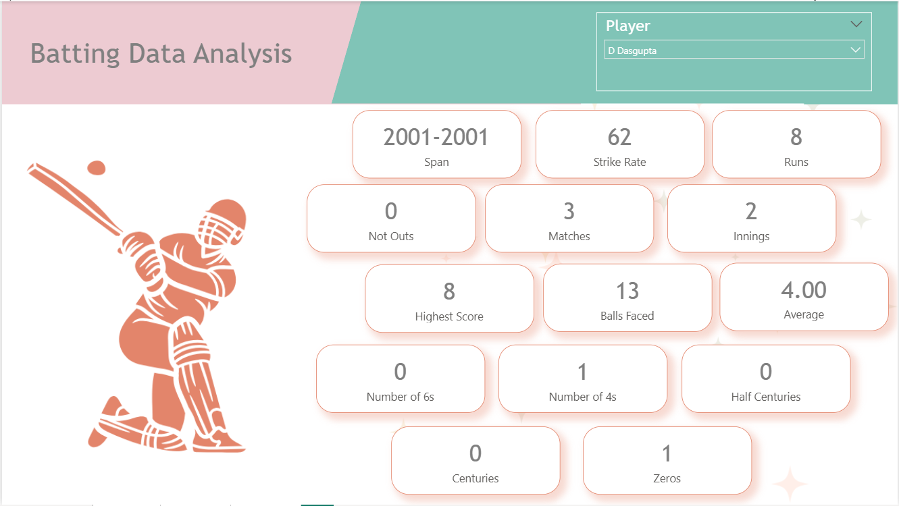
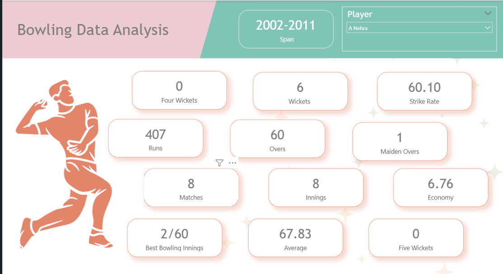
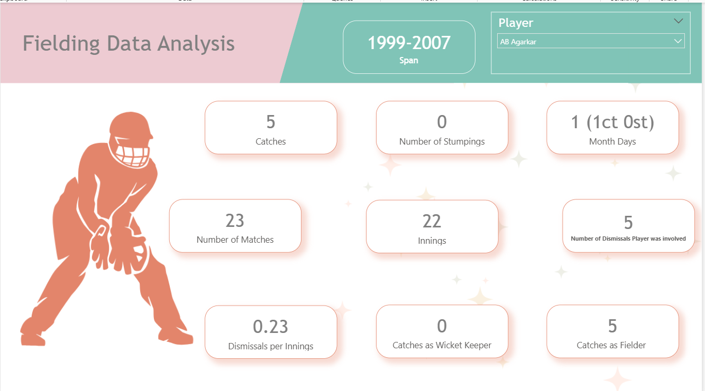

 📊 Power BI Project – India vs South Africa ODI Analysis

📌 Overview

This project presents an interactive Power BI dashboard analyzing **One Day International (ODI)** cricket data between **India and South Africa**.

The analysis is divided into:

* 🏏 Batting Performance
* 🎯 Bowling Performance
* 🧤 Fielding Performance

 🖼️ Dashboard Preview

🏏 Batting Analysis

🎯 Bowling Analysis

 🧤 Fielding Analysis

 🌐 Data Source

Data is dynamically fetched from ESPN Statsguru:

* Batting:
  https://stats.espncricinfo.com/ci/engine/stats/index.html?class=2;opposition=3;team=6;template=results;type=batting

* Bowling:
  https://stats.espncricinfo.com/ci/engine/stats/index.html?class=2;opposition=3;team=6;type=bowling

* Fielding:
  https://stats.espncricinfo.com/ci/engine/stats/index.html?class=2;opposition=3;team=6;template=results;type=fielding

 ⚙️ Data Collection Process (Power BI)

1. Open **Power BI Desktop**
2. Click **Home → Get Data → Web**
3. Select **Basic** and paste the URL
4. Click **OK**
5. In Navigator, select the required table
6. Click **Transform Data**
🔄 Data Transformation (Power Query Editor)

* Cleaned and structured data using Power Query
* Removed unnecessary columns
* Renamed columns
* Handled missing values
* Converted data types

Finally:

* Click **Close & Apply**

📊 Dashboard Features

* Interactive visuals and filters
* Player performance comparison
* Key metrics:

  * Batting → Runs, Average, Strike Rate
  * Bowling → Wickets, Economy
  * Fielding → Catches, Dismissals

 📁 Project Files

* `Cricket_Data_Analysis.pbix` → Power BI dashboard
* Dashboard images (`.png`)

⚠️ Important Notes

* Data is fetched live from the website
* Internet connection is required
* Refresh depends on website structure
* Website changes may cause errors
*
 ▶️ How to Use

1. Download the `Cricket_Data_Analysis.pbix` file
2. Open in Power BI Desktop
3. Select:

   * Authentication: **Anonymous**
   * Privacy Level: **Public**
4. Click **Refresh**

💡 Technical Highlight

This project uses **Power Query Web Scraping** instead of static datasets, making it dynamic and real-time.
 🎯 Use Case

* Sports analytics
* Data visualization projects
* Power BI portfolio

🚀 Future Improvements

* Add more teams
* Include T20/Test formats
* Improve dashboard UI

 👤 Author
 Fatima Bee Shaikh
